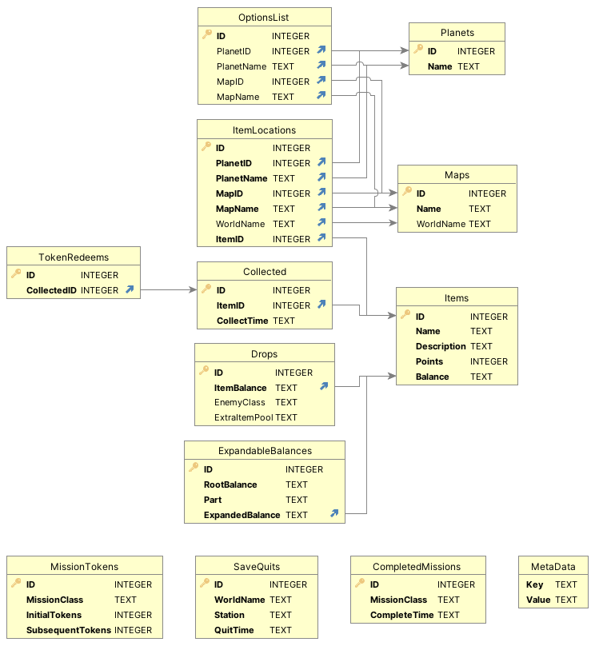

# Database Generator
This folder contains the scripts which generate the template database for the tracker.

## Using the generation script
1. Download [the hunt sheet](https://docs.google.com/spreadsheets/d/1wwxGn2XY14qtANYcWDdREvZQzHU5c7_EGNXUQTjgW_o/edit#gid=0)
   as a csv, and put it in this folder. It should be named `BL3 Hunt Sheet v3 - Drops.csv`.
2. Download version 13 of [the uniques db](https://github.com/apple1417/gen_uniques_db/releases/tag/v13),
   and put it in this folder.
3. Navigate to this folder, and run `generate.py`.

# Database Design
The template database includes all the information the tracker uses - so in theory, you could swap
it out with your database to create a custom "Skin Hunt" or "Redux Hunt", without needing to touch
any code. The database is designed in such a way it could even be ported to other games, though of
course this makes it more likely to run into edge cases requiring code tweaks.
 
Unfortuately, as the tracker has grown, the generation script has become into an unweildy monolith,
with lots of hardcoded edge cases specifically for the primary ruleset - so if you're trying to make
your own, you probably won't be able to pull to much from it.

Note anywhere the rest of the page mentions a "path name", that's excluding the class - i.e.
`/Game/Some/Object.Path`, not `Object'/Game/Some/Object.Path'`. Anywhere it mentions a "short name",
it's just the name of the final object in the path - i.e. `Path`.

## Case Sensitivity
Both path names and short names are made up of `FName`s. Unreal generally considers these case
insensitive. Technically, there's no guarantee what casing you'll get when you read one out, and it
may change between game launches, but in practice it's constant. The tracker performs case sensitive
comparisons however. If you're careful, you can just make sure all entries in the database have the
casing you get when reading them out, and it isn't really a problem. As an extra piece of safety
however, when creating your tables you can set the relevant columns as `COLLATE NOCASE`. Setting
this on the table is more efficient than doing so every query.

## Multiple Connections
TLDR: enable WAL when generating your template database: `PRAGMA journal_mode = WAL`.

The tracker uses a native module to detect valid drops, as an optimization for cases like jackbot,
who "drops" >600 items at once (all the money in the vault). This however means that the database
may have multiple active connections from "different processes" - both the native module and
Python's. This can cause freezes when the db is written to, if one connection blocks (on the main
thread) until the other finishes it's transaction.

The native module only ever does reads, in fact only opening the database in read-only mode, and
only ever from the `Drops`, `ExpandableBalances`, and `Items` tables. This means simply enabling
[Write-Ahead Logging](https://www.sqlite.org/wal.html) is enough, which prevents reads and writes
from blocking each other. This is a feature of the database, not the connection, so must be set in
your template file.

## Schema


### `MetaData`
Holds miscellaneous metadata about the database. Not really intended for programmatic access.

| Column | Description                      |
| ------ | -------------------------------- |
| Key    | Primary key. The metadata's key. |
| Value  | The metadata's key.              |

Whenever the tracker reloads the db from the template, it inserts the key `StartTime`, with the
current datetime as the value.

### `Items`
Probably the most important table: all the actual items you need to collect. Do not add unobtainable
items, every row in this table must be an actual item players are expected to collect.

| Column      | Description                                                                                                                          |
| ----------- | ------------------------------------------------------------------------------------------------------------------------------------ |
| ID          | Primary key.                                                                                                                         |
| Name        | The item's name.                                                                                                                     |
| Description | The pre-formatted HTML description - all the fancy text you see scrolling through the item list is just copied straight out of here. |
| Points      | How many points the item is worth. Should probably be a positive integer.                                                            |
| Balance     | The path name of the item's balance. Very important to get this right. Should be case insensitive.                                   |

The completion counter is added by the tracker in front of the description, it's not part of it.

### `ExpandableBalances`
The original legendary Artifacts/COMs used a single generic balance, but when they added dedicated
sources, they also added dedicated balances. Since these balances are indistinishable in game, we
use this table to map the generic balances back to the dedicated ones, which are used everywhere
else in the db.

| Column          | Description                                                                                 |
| --------------- | ------------------------------------------------------------------------------------------- |
| ID              | Primary key.                                                                                |
| RootBalance     | The path name of the root balance.  Should be case insensitive.                             |
| Part            | The part which matches this particular mapping. Should be case insensitive.                 |
| ExpandedBalance | Foreign Key on `Items(Balance)`. The balance this part maps to. Should be case insensitive. |

If an item matches `RootBalance`, it's part list is looked through, and the first part which is in
`Part` is matched, and `ExpandedBalance` is used in further processing. If no part match is found,
the root balance is passed on to the further processing instead.

While not designed for it, you could probably repurpose this table to add part-specific drops.

### `Drops`
This is the list of valid drops.

| Column        | Description                                                                                                      |
| ------------- | ---------------------------------------------------------------------------------------------------------------- |
| ID            | Primary key.                                                                                                     |
| ItemBalance   | Foreign Key on `Items(Balance)`. Should be case insensitive.                                                     |
| EnemyClass    | The path name of the enemy class which is allowed to drop this item. Null means any. Should be case insensitive. |
| ExtraItemPool | The path name of the extra item pool, set by spawn options. Null means any. Should be case insensitive.          |

If `EnemyClass` is null, any drop of the item anywhere will be accepted, it makes it a world drop.
`ExtraItemPool` is completely ignored in this case.

Mincemeat uses the standard badass psycho enemy class, and Muldock uses the standard anointed
enforcer class. They both use spawn options to rename themseleves, and to add the custom drops. The
`ExtraItemPool` column can be used to filter these cases - to prevent world drop Tunguska from a
regular badass psycho from being accepted. In 99% of cases, this column should just be null.

### `Collected`
The list of collected items. The tracker writes every found item into this, including duplicates.

| Column      | Description                                               |
| ----------- | --------------------------------------------------------- |
| ID          | Primary key.                                              |
| ItemID      | Foreign Key on `Items(ID)`. The item which was collected. |
| CollectTime | A datetime, defaults to the current timestamp.            |

This table should also have an index on item id, since a number of lookups will filter by it.

```sql
CREATE INDEX CollectedItemIDIndex ON Collected(ItemID)
```

### `TokenRedeems`
This table records all the rows in `Collected` which come from world drop token redeems - redeeming
one inserts into both tables.

| Column    | Description                    |
| --------- | ------------------------------ |
| ID        | Primary key.                   |
| Collected | Foreign Key on `Collected(ID)` |

### `MissionTokens`
This table holds which mission completions unlock extra world drop tokens, and how many.

| Column           | Description                                                                                |
| ---------------- | ------------------------------------------------------------------------------------------ |
| ID               | Primary key.                                                                               |
| MissionClass     | The path name of the mission class to watch for completion on. Should be case insensitive. |
| InitialTokens    | How many tokens this mission is worth on the first completion.                             |
| SubsequentTokens | How many tokens this mission is worth on subsequent completions.                           |

Note that the description of the tokens option is hardcoded, it is not based on this table.

### `CompletedMissions`
The tracker inserts all completed missions into this table.

| Column       | Description                                                                      |
| ------------ | -------------------------------------------------------------------------------- |
| ID           | Primary key.                                                                     |
| MissionClass | The path name of the class of the completed mission. Should be case insensitive. |
| CompleteTime | A datetime, defaults to the current timestamp.                                   |

`MissionClass` directly relates to `MissionTokens(MissionClass)` - however there isn't an explicit
foreign key relationship. The tracker inserts every single mission, as this info can be used for
interesting data analysis, but this means we don't want to restrict it to just the missions which
reward tokens.

### `SaveQuits`
This table exists purely for data analysis. The tracker inserts every save quit into it, which
allows coming up with interesting stats such as "Total SQs" or "SQs since last drop".

| Column    | Description                                                                                      |
| --------- | ------------------------------------------------------------------------------------------------ |
| ID        | Primary key.                                                                                     |
| WorldName | The short name of the map the SQ was on. Should be case insensitive.                             |
| Station   | The path name of the respawn station the player was at when they sq. Should be case insensitive. |
| QuitTime  | A datetime, defaults to the current timestamp.                                                   |

`WorldName` is *not* a foreign key on `Maps(WorldName)`. This makes sure this table can still be
insert into even if the maps table is incomplete.

### `StatMarks`
Again, this table exists purely for data analysis. Users can create a new mark at any time, which
inserts a new row with the current time, allowing queries like "SQs since last mark".

| Column   | Description                                    |
| -------- | ---------------------------------------------- |
| ID       | Primary key.                                   |
| MarkTime | A datetime, defaults to the current timestamp. |

The tracker assumes the lowest row is always the latest mark - it only ever inserts default values.

### `Planets`
Essentially just an enum. The names of the "planets" we sort the options list into.

| Column | Description             |
| ------ | ----------------------- |
| ID     | Primary key.            |
| Name   | The name of the planet. |

### `Maps`
Essentially just an enum. The names of the maps we sort the options list into.

| Column    | Description                                                                                                                         |
| --------- | ----------------------------------------------------------------------------------------------------------------------------------- |
| ID        | Primary key.                                                                                                                        |
| Name      | The display name of the map.                                                                                                        |
| WorldName | The short name of the map's world object. May be null for "pseudo-maps", used only in the options list. Should be case insensitive. |

### `OptionsList`
Defines the categories and the ordering of the outermost item list in options.

| Column     | Description                     |
| ---------- | ------------------------------- |
| ID         | Primary key, used for ordering. |
| PlanetID   | Foreign key on `Planet(ID)`.    |
| PlanetName | Foreign key on `Planet(Name)`.  |
| MapID      | Foreign key on `Map(ID)`.       |
| MapName    | Foreign key on `Map(Name)`.     |

This table essentially pre-joins the planet/map name for more efficient lookups at runtime.

In each row, one of the planet or map must always be null. If the map is null, the options list
shows an option for the planet, which itself then expands to each map. If the planet is null, the
options list puts the map at the top level instead.

### `ItemLocations`
This table maps items to the planets/maps they should appear under in the options list. It answers
the question "if I'm on planet/map x, what items can I get?".

Note this has no influence on where items are actually allowed, it's only used for the options list.

| Column     | Description                                                  |
| ---------- | ------------------------------------------------------------ |
| ID         | Primary key, used for ordering.                              |
| PlanetID   | Foreign key on `Planet(ID)`.                                 |
| PlanetName | Foreign key on `Planet(Name)`.                               |
| MapID      | Foreign key on `Map(ID)`.                                    |
| MapName    | Foreign key on `Map(Name)`.                                  |
| WorldName  | Foreign key on `Map(WorldName)`. Should be case insensitive. |
| ItemID     | Foreign key on `Items(ID)`.                                  |

As above, this table pre-joins the planet/map tables - though this time, both planet and map are
required in every row.

## Views
### `CollectedItems`
This view just adds collection information on top of the standard columns in `Items`.

```sql
CREATE VIEW CollectedItems AS
SELECT
    ID,
    Name,
    Description,
    Points,
    Balance,
    (
        SELECT COUNT(*) FROM Collected as c WHERE c.ItemID = i.ID
    ) as NumCollected,
    (
        SELECT
            CollectTime
        FROM
            Collected
        WHERE
            ItemID = i.ID
        ORDER BY
            CollectTime ASC
        LIMIT 1
    ) as FirstCollectTime
FROM
    Items as i
```

### `CollectedLocations`
This view is used to calculate the planet/map collection summaries - so it adds some collection
information ontop of `ItemLocations`, and drops a few fields which aren't needed.

```sql
CREATE VIEW CollectedLocations AS
SELECT
    l.ID,
    l.PlanetID,
    l.MapID,
    l.MapName,
    l.ItemID,
    i.Points,
    (
        SELECT COUNT(*) FROM Collected as c WHERE c.ItemID = i.ID
    ) as NumCollected
FROM
    ItemLocations as l
LEFT JOIN
    Items as i ON l.ItemID = i.ID
```

### `AvailableTokens`
This view is essentially just used as a replacement for a stored procedure. It performs the
calculation to get the number of available world drop tokens, and returns it as a single row/column.

```sql
CREATE VIEW AvailableTokens AS
SELECT
    (
        IFNULL(SUM(Tokens), 0)
        + 1
        - IFNULL((SELECT COUNT(*) FROM TokenRedeems), 0)
    )
    as Tokens
FROM
(
    SELECT
        CASE COUNT(*)
            WHEN 0 THEN 0
            WHEN 1 THEN t.InitialTokens
            ELSE t.InitialTokens + (t.SubsequentTokens * (COUNT(*) - 1))
        END as Tokens
    FROM
        MissionTokens as t
    INNER JOIN
        CompletedMissions as c ON t.MissionClass = c.MissionClass
    GROUP BY
        t.ID
)
```

You could redefine this view to always return 0 as a basic way to disable the whole world drop token
system.
